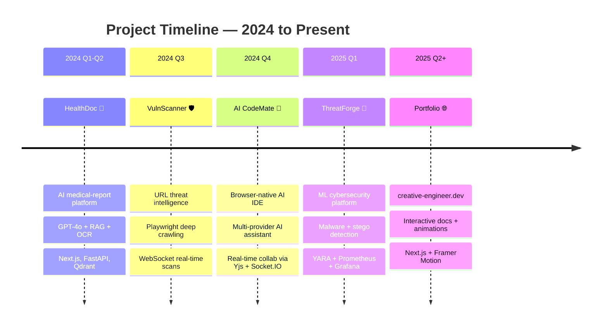
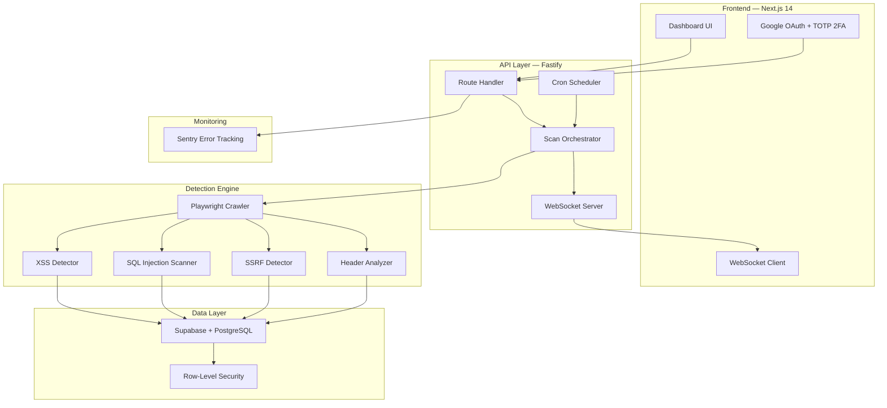

<div align="center">

<!-- Animated Header -->


<br/>

<!-- Social Badges -->
[](https://creative-engineer.dev/)
[](https://www.linkedin.com/in/krishna-kapoor-517546270/)
[](mailto:creativesimulation1@gmail.com)
[](https://github.com/krishna0605)

<br/>

<!-- Profile Views & Followers -->


</div>

---

## 🧑‍💻 About Me

```yaml
name: Krishna Kapoor
location: Pune, Maharashtra, India
roles:
  - Full-Stack Developer
  - AI/ML Engineer
  - Cybersecurity Enthusiast
currently_building: AI-powered developer tools & security platforms
portfolio: https://creative-engineer.dev/
contact: creativesimulation1@gmail.com
```


- 🔭 Building **AI-powered platforms** — from browser IDEs to threat detection engines
- 🧠 Passionate about **AI/ML**, **Cybersecurity**, and **Real-time Systems**
- 🏗️ Love architecting **full-stack applications** with modern cloud infrastructure
- � Check out my portfolio at **[creative-engineer.dev](https://creative-engineer.dev/)**
- 📫 Reach me at **creativesimulation1@gmail.com**
- ⚡ I've shipped **5 production-grade platforms** spanning AI, health-tech, and cybersecurity

<br clear="both"/>

---

## 🎯 What I'm Working On

<div align="center">

| | |
|:---:|---|
| 🔨 **Currently Building** | AI CodeMate v2 — real-time collaborative IDE with multi-AI providers |
| 🧪 **Experimenting With** | LLM fine-tuning, RAG pipelines, Agentic AI workflows |
| 📚 **Currently Learning** | Rust, Go microservices, Kubernetes orchestration |
| 🤝 **Open To** | Full-stack roles, AI/ML engineering, Cybersecurity positions |
| 💬 **Ask Me About** | React, Next.js, AI integrations, security architecture |

</div>

---

## 💡 How I Build

<div align="center">

> *"Ship fast, iterate faster. Security isn't optional — it's foundational."*

> *"Every system I build is designed to scale. Clean architecture today saves refactors tomorrow."*

> *"AI should augment developers, not replace them. That's why I build tools, not toys."*

</div>

---

## 📈 Profile Summary

<div align="center">


</div>

---

## 🗺️ My Development Journey



---

## 🚀 Featured Projects

<div align="center">

<table>
<tr>
<td width="50%" valign="top">

### 🤖 [AI CodeMate](https://ai-codemate-nine.vercel.app/)
**Browser-native AI IDE with real-time collaboration**


- Monaco Editor with 50+ language support & live preview
- Multi-provider AI (Gemini, HuggingFace, Ollama, OpenRouter)
- Real-time collab via Yjs CRDTs + Socket.IO with cursors
- GitHub OAuth repo import, diff viewer & branch management

</td>
<td width="50%" valign="top">

### 🛡️ [VulnScanner](https://vulnscanner.tech/)
**AI-powered URL threat intelligence platform**


- Deep web crawling with Playwright for vulnerability detection
- XSS, SQL injection, SSRF & insecure header detection
- Real-time scan progress via WebSockets
- Executive security dashboards with severity-based findings

</td>
</tr>
<tr>
<td width="50%" valign="top">

### 🔐 [ThreatForge](https://threat-forge.vercel.app/)
**AI cybersecurity platform with ML threat detection**


- ML-based malware, steganography & network anomaly detection
- YARA engine + threat intel feeds + geo-mapped dashboard
- Automated PDF security report generation
- Prometheus/Grafana monitoring + WebSocket alerts

</td>
<td width="50%" valign="top">

### 🏥 [HealthDoc](https://healthdocliv.app/)
**AI medical-report platform with RAG Q&A**


- OCR upload with dual clinical/patient summaries
- GPT-4o-mini + RAG (Qdrant) for context-aware Q&A
- Abnormality detection (High/Low/Critical flagging)
- Family tracking, 2FA, audit logs & cloud deployment

</td>
</tr>
</table>

</div>

---

## 🏗️ Architecture Showcase — VulnScanner

*How I design production systems — example from [VulnScanner](https://vulnscanner.tech/):*



---

## 📊 GitHub Analytics

<div align="center">


*🟢 Contribution calendar — darker squares = more commits that day*

</div>

---

## 🏅 GitHub Achievements

<div align="center">


</div>

---

## 🔝 Most Active Repositories

<div align="center">


</div>

---

## 📊 Weekly Development Breakdown

<!--START_SECTION:waka-->

```text
TypeScript   12 hrs 45 min  ██████████░░░░░░░░░░░  42.8%
Python        6 hrs 20 min  █████░░░░░░░░░░░░░░░░  21.3%
JavaScript    4 hrs 15 min  ███░░░░░░░░░░░░░░░░░░  14.3%
CSS           2 hrs 10 min  ██░░░░░░░░░░░░░░░░░░░   7.3%
YAML          1 hr  30 min  █░░░░░░░░░░░░░░░░░░░░   5.0%
Other         2 hrs 45 min  ██░░░░░░░░░░░░░░░░░░░   9.3%
```

<!--END_SECTION:waka-->

<div align="center">

*⏱️ Updated automatically via [WakaTime](https://wakatime.com/) — install the VS Code extension to see your real stats*

</div>

---

## 🛠️ Tech Stack

<div align="center">

### 💻 Languages


### 🎨 Frontend


### ⚙️ Backend & Cloud


### 🗄️ Databases


### 🤖 AI / ML


### 🔧 DevOps & Tools


### 🖥️ Platforms & IDEs


### 📊 Data & Analytics


</div>

---

## 🎓 Certifications

<div align="center">

| Badge | Certification | Issuer |
|:---:|---|---|
| 🤗 | **Hugging Face Agent Course** | Hugging Face |
| 🛡️ | **Cybersecurity Hands-on Workshop** | NIT Goa & NFSU Goa |
| ☁️ | **Google Cloud Cybersecurity Certificate** | Google Cloud |
| ☁️ | **Google Cloud Computing Foundations** | Google Cloud |
| 🐍 | **Python Essentials 1** | Cisco |
| 🔒 | **Cyber Threat Management** | Cisco |
| 💻 | **100x Devs Cohort 3** | 100xDevs |

</div>

---

## � Let's Connect

<div align="center">

| | |
|:---:|:---:|
| 🌐 **Portfolio** | [creative-engineer.dev](https://creative-engineer.dev/) |
| � **LinkedIn** | [Krishna Kapoor](https://www.linkedin.com/in/krishna-kapoor-517546270/) |
| 📧 **Email** | [creativesimulation1@gmail.com](mailto:creativesimulation1@gmail.com) |


<br/>

### ✍️ Dev Quote of the Day


<br/>

### 💬 *"Building intelligent systems that make the web safer and development faster."*

<br/>

[](https://creative-engineer.dev/)
[](mailto:creativesimulation1@gmail.com)

<br/>


</div>
